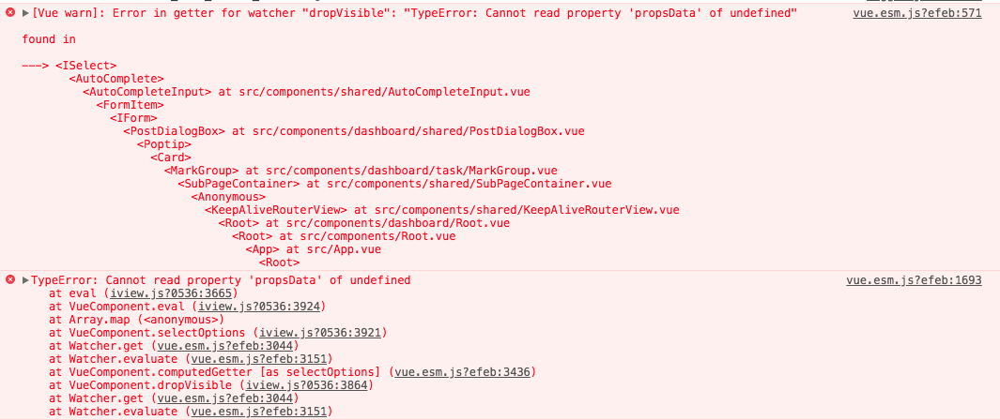
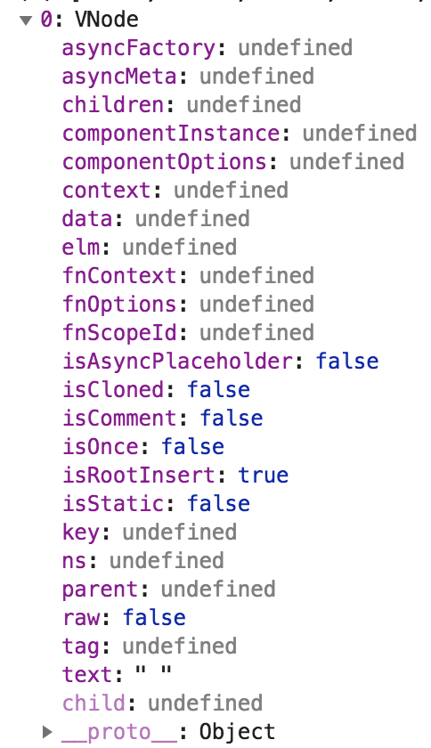

# 分享一个 iView 调试案例

> 本文记录笔者在工作中，遇到的一个 iview 的 `AutoComplete` 组件的 bug，以及详细调试过程。
> 本文不对 iview 做过多讲解，也没有多少源码分析的意味，更多是想表达出在使用开源框架遇到问题时，
> 如何根据问题的表征，一步一步推导出问题的源头、找出解决方案。

## 版本升级触发的 bug

最近抽空对项目用的 iView 版本做升级，从 2.6.0 升到 2.14.2，原以为不会有太大问题，但在 [AutoComplete](https://www.iviewui.com/components/auto-complete) 组件上报了一些错误：



分析调用的上下文代码后，发现在将 `AutoComplete` 组件的值设置为 `null` 时，会触发这个异常，我简化了调用的上下文代码，做了一个 [Demo](https://codepen.io/vanmess/pen/ZRJGma)，代码如下所示。我在 [codepen](https://codepen.io/vanmess/pen/ZRJGma) 上放了实例，建议点进去看看，直观感受下， **记住：请打开控制台看报错信息**。

```vue
<template>
  <div>
    <AutoComplete v-model="value">
      <Option v-for="item in persons" :value="item" :key="item">
        <span>{{item}}</span>
      </Option>
    </AutoComplete>
    <Button type="primary" @click="reset">test</Button>
  </div>
</template>

<script type="text/ecmascript-6">
const PERSONS = ["tec", "van", "is", "good"];

export default {
  data() {
    return { value: "" };
  },
  computed: {
    persons() {
      return PERSONS;
    }
  },
  methods: {
    reset() {
      this.value = null;
    }
  }
};
</script>
```

从异常信息看，问题的核心是 `i-select` 组件发生 `TypeError: Cannot read property 'propsData' of undefined`，也就是有一些 `undefined` 值在预期之外地流入 `i-select` 逻辑中。问题本身已经解决了，本文做一个记录，记录如何一步一步解决此问题。

## 从源码 Debug

首先，从报错堆栈找到抛出异常的位置，代码如下：

```javascript
var applyProp = function(node, propName, value) {
  (0, _newArrowCheck3.default)(undefined, undefined);

  return (0, _extends4.default)({}, node, {
    componentOptions: (0, _extends4.default)({}, node.componentOptions, {
      propsData: (0, _extends4.default)(
        {},
        // 这一句抛出了 undefined 异常
        node.componentOptions.propsData,
        (0, _defineProperty3.default)({}, propName, value)
      )
    })
  });
}.bind(undefined);
```

> Tips:
>
> 报错语句中的 [`propsData` 属性](https://cn.vuejs.org/v2/api/#propsData)，在日常开发中接触的不多，
> vue 官网解释的有点粗略：
>
> **创建实例时传递 props。主要作用是方便测试**
>
> 简单的说，就是 vue 会将父级组件传递的 props 属性合并成一个对象，该对象即为 `propsData` 属性。

这是一段 babel 编译过的代码，看起来真心有些吃力，所以强烈建议先 [配置 iview 调试环境](https://juejin.im/post/5b2257e4518825748a579dad)，配置后，可以看到错误发生在 [src/components/select.vue](https://github.com/VanMess/iview/blob/2.0/src/components/select/select.vue#L113) 文件，源码为：

```javascript
const applyProp = (node, propName, value) => {
  return {
    ...node,
    componentOptions: {
      ...node.componentOptions,
      propsData: {
        ...node.componentOptions.propsData,
        [propName]: value
      }
    }
  };
};
```

嗯，这样看起来清爽多了。上面的代码就只是个很简单的属性合并函数，确实是在这个函数触发的 bug，但问题的重点调用方传递过来的参数，不符合该函数的预期，追本溯源，接下来我们从几个方面分析问题：

1.  何时调用 `applyProp` 函数？
2.  参数 `node` 是为何物？
3.  为什么会出现 `node.componentOptions` 值为 `undefined` 的情况？

### 1. 何时调用 `applyProp` 函数？

在 `src/components/select.vue` 文件中搜索，发现该函数只在 [计算器 `selectOptions`](https://github.com/VanMess/iview/blob/2.0/src/components/select/select.vue#L330) 被调用，简化后的调用代码：

```javascript
selectOptions() {
    // ...
    const slotOptions = (this.slotOptions || []);
    // ...
    if (this.autoComplete) {
        // ...

        return slotOptions.map(node => {
            if (node === selectedSlotOption || getNestedProperty(node, 'componentOptions.propsData.value') === this.value) {
                return applyProp(node, 'isFocused', true);
            }
            return copyChildren(node, (child) => {
                if (child !== selectedSlotOption) return child;
                return applyProp(child, 'isFocused', true);
            });
        });
    }
    // ...
},
```

结合 `applyProp` 源码，推测这里的意图是给符合条件的 `slotOptions` 项加上 `isFocused` 属性。但`selectOptions` 计算器代码太长，有太多的依赖： `slotOptions`、`focusIndex`、`values`、`autoComplete`...根据[计算属性的特性](https://juejin.im/post/5af1980a6fb9a07acb3cd4e3)可以推断，这些依赖的变更会触发 `selectOptions` 计算器重新执行计算，进而隐式调用了 `applyProp` 函数，也就是说，有太多种可能性，会导致 `applyProp` 被调用。

### 2. 参数 `node` 是为何物？

在上面的 `selectOptions` 计算器，会迭代 `slotOptions` ，将数组项以 `node` 参数形式，传入 `applyProp`函数。在源码中搜索，确定 `slotOptions` 属性分别在两个地方被赋值：

```javascript
data () {
    return {
        // ...
        slotOptions: this.$slots.default,
        // ...
    };
},
methods:{
    // ...
    updateSlotOptions(){
        this.slotOptions = this.$slots.default;
    },
    // ...
}
```

可以看出， `slotOptions` 只是 `this.$slots.default` 的一个 **替身**，即组件的默认插槽，打印 `slotOptions` 值得：


可以看到，这是一个个 [`vnode` 实例](https://github.com/snabbdom/snabbdom)。

> 这里可以引发另外一个思考：为什么要通过 `data` 属性，保存 `this.$slots.default` 值？
>
> 组件渲染时，调用相应的 `render` 函数，生成 `vnode` 树，但 `vnode` 树并不在 vue 的响应系统中 —— `vnode` 的变化无法被捕捉，
> 所以，为了监控 vnode 的变化，iview 将其加入 data 属性，为此，iview 还专门加了一个组件 [`functional-options.vue`](https://github.com/VanMess/iview/blob/2.0/src/components/select/functional-options.vue) 做 `vnode` 更新的检测。
>
> 当我们需要监控响应系统外的变化时，这种方案确实简单粗暴直接，但在 `i-select` 这种场景下，其实有更优雅的解决方案：
>
> **使用 [`slot-scope`](https://cn.vuejs.org/v2/api/#vm-scopedSlots) 替代简单的 `slot`**
>
> 这是事关组件设计，非常值得思考的一个点，回头另起一篇文章讨论。

### 3. 为什么会出现 `node.componentOptions` 值为 `undefined` 的情况？

我们回头看看 `slotOptions` 值：


数组的第一项有些奇怪， `tag` 值为 `undefined`？展开此项，对象的属性值如下：



> Tips: `tag` 为 `undefined` 的节点是通过 `_t` 函数创建的，即 `vnode` 中的 text 节点。

在该项上执行计算属性 `selectOptions` 中的[求值函数](https://github.com/VanMess/iview/blob/2.0/src/components/select/select.vue#L347)：

```javascript
getNestedProperty(node, "componentOptions.propsData.value");
```

取得的值刚好为 `null`。好了，问题到这里已经找到了，异常触发的步骤如下：

1.  计算器 `selectOptions` 遍历 `this.$slots.default` 节点
2.  查找 `vnode` 节点中，值等于 `value` 属性的节点
3.  当 `value` 值为 `null` 时， `$slots.default` 第一个文本节点符合条件
4.  将该文本节点传入 `applyProps` 函数
5.  `applyProps` 函数执行 `node.componentOptions.propsData` 求值，但文本节点的 `componentOptions` 属性为 `undefined`
6.  触发 `TypeError: Cannot read property 'propsData' of undefined` 异常

## 解决方案

综上，我们已经找到了问题触发的步骤、场景，找到问题所在，接下来，该撸起袖子改代码了。针对这个 bug，我粗浅地想到了几个解决方案：

### 1. 在代码中避免使用 `null` 值

这应该是用户侧能想到的最靠谱，成本最低，也是最无奈的方案了：既然框架不靠谱，那就限制我自己的用法好了。
确实，大多数应用场景中是可以避免使用 `null` 作为 `key`，
如果这是 **By Designed**，那只要把文档补充完整，把事情说清楚，我相信大多数开发者是能够接受的；
但这个行为完全是预期外的 —— 没有任何官方文档说明这个问题，在 git 上相关的 issue 也不多。
作为用户，也只能默默遇坑，填坑，从错误中学习。

### 2. 过滤掉 tag 为 undefined 的 node

既然问题出现在计算 `selectOptions` 属性时，传递了错误的 `vnode` 节点，那修改 `i-select` 组件代码，在调用 `applyProps` 之前做好参数判断即可，示例代码：

```javascript
selectOptions() {
    // ...
    const slotOptions = (this.slotOptions || []);
    // ...
    if (this.autoComplete) {
        // ...

        return slotOptions.map(node => {
            // 加一段判断语句，当 tag 不在预期时，简单返回该node
            if (typeof node.tag === "undefined") return node;
            if (node === selectedSlotOption || getNestedProperty(node, 'componentOptions.propsData.value') === this.value) {
                return applyProp(node, 'isFocused', true);
            }
            return copyChildren(node, (child) => {
                if (child !== selectedSlotOption) return child;
                return applyProp(child, 'isFocused', true);
            });
        });
    }
    // ...
},
```

修改成本很低，也很有效，但这种方式却预定了不能传入 `tag` 为 `undefined` 的值，比如：

```javascript
<AutoComplete v-model="value" placeholder="input">
  <template v-for="item in persons">{{ item }}</template>
</AutoComplete>
```

即不能以字符串方式传递 `slot` 值，这一点与 iview 官网声称调用方式兼容，所以问题不大，勉强可以接受。

## 总结

到这里，相信大家
