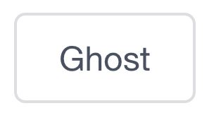
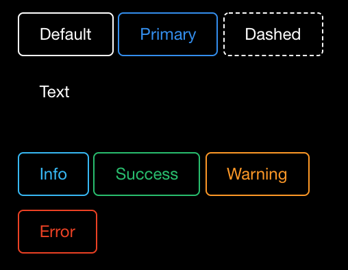
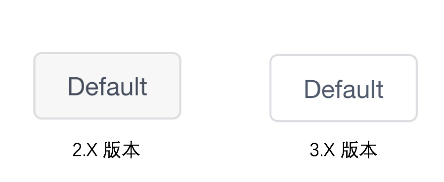
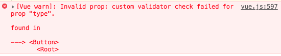

# iview 升级指南 —— Button 篇

> iview 在今年 7 月 28 号发布了 3.0.0 版本，大版本升级往往意味着功能、接口的大变更。
> 虽然官网已经有长长的[更新日志](https://www.iviewui.com/docs/guide/update)，但看起来还是有些抽象了，
> 所以我决定做个新旧版本的比较，盘点新版本到底为我们带来了什么新特性。
>
> 这一篇给大家讲解的，是一个很常用的组件 —— `Button`

## 先看结论

新版 `Button` 有如下新特性：

1.  支持链接模式，可通过配置 `to` 属性启动
2.  支持独立 `ghost` 属性，样式上可与其他的 `type` 值复合
3.  支持自定义图标，可参考 [《iview 3.x 升级盘点 —— Icon 篇》](http://www.thinkinfe.tech/iview-migration-icon/)

`Button` 的升级相对还是比较平滑的，需要注意两点：

1.  新版本不支持 `type="ghost"`，但可以使用独立的 `ghost` 属性，所以升级前，建议全局搜索 `type="ghost"` 的调用
2.  新旧版本的 `default` 样式有些不同

## 支持链接模式

旧版本的 `Button` 组件只单纯包裹了一个 `button` 标签。
新版本 `Button` 新增了一个关键属性：`to` —— 一般情况下，组件会渲染为 `button` 标签；
假如 `to` 有值，则组件会渲染为 `a` 标签。

虽然破坏了 `Button` 的语义，但这个特性还挺方便的，在过去，为了给 `a` 标签应用 `Button` 样式，往往需要自己写上 class：

```html
<!-- 普通 a 标签 -->
<a class="ivu-btn ivu-btn-primary" href="/foo/bar">这是一个 a 链接</a>
<!-- router-link -->
<router-link class="ivu-btn ivu-btn-primary" to="/foo/bar">这是一个 router-link</router-link>
```

虽然可以复用按钮样式，但却丧失了 `Button` 的行为，比如 loading、icon 等。新版本支持链接模式后就没有这个问题了，同样的逻辑，可以写成：

```html
<Button type="primary" to="/foo/bar">这是一个链接</Button>
<!-- 最终渲染为 -->
<a class="ivu-btn ivu-btn-primary" href="/foo/bar">这是一个链接</a>
```

`to` 属性值支持 `string`、`object` 两种类型，iview 会优先使用 `vue-router` 的相关函数处理链接跳转；当应用环境中没有 `vue-router` 时，则会退化成普通的 `window.location.href = this.to;` 调用。
除了 `to`， `Button` 还新增了 `replace`、`target` 两个属性，用于补充链接的定义。`replace` 属性语义与 [`router-link` 的 replace](https://router.vuejs.org/zh/api/#replace) 属性的语义相同；`target` 属性则与 [`a` 标签的 target](http://devdocs.io/html/attributes#target-attribute) 属性相同。

总的来说，在链接模式下，你可以把 `Button` 理解为一个阉割版的 `router-link` 组件。

## 独立 `ghost` 属性

幽灵按钮是一个曾经被广泛讨论的话题，现在已经是一种很常规的设计了。这种设计指定按钮的背景色必须是透明的，而并没有定义字体、边框样式，但旧版本 `Button` 只支持一种灰色调调的 ghost：



新版本在这方面做了很大改进，将 `ghost` 样式独立为一类 class，配合其他 `type` 类型作为按钮字体、边框颜色的补充，相得益彰，可以看看 iview 官网提供的 [示例](https://jsfiddle.net/api/post/library/pure/)：



多种色值形态的幽灵按钮确实可以大大提高提升实用性。曾经 [1.x 版本](http://1x.ant.design/components/button/) 的 antd 也把 ghost 作为一种 type 看待，到了[2.x 版本](http://2x.ant.design/components/button/) 也抽出来做为一个独立特性，iview 这个改进，看来也算是有依有据，亦步亦趋了。

不过，尴尬的是，iview 顺手把 `default` 的样式也给改了，对于设计有较高要求的团队得注意了：



## 问题

好了，特性与变更都聊完了，最后我们来看看代码。 新版 `Button` 的代码只有 [116 行](https://github.com/VanMess/iview/blob/3.0.0/src/components/button/button.vue)却有不少值得玩味的地方：

### 1. 重复代码

新版 `Button` 的模板是这样的：

```html
<template>
    <a
        v-if="to"
        ...>
        <Icon class="ivu-load-loop" type="ios-loading" v-if="loading"></Icon>
        <Icon :type="icon" :custom="customIcon" v-if="(icon || customIcon) && !loading"></Icon>
        <span v-if="showSlot" ref="slot"><slot></slot></span>
    </a>
    <button
        v-else
        ...>
        <Icon class="ivu-load-loop" type="ios-loading" v-if="loading"></Icon>
        <Icon :type="icon" :custom="customIcon" v-if="(icon || customIcon) && !loading"></Icon>
        <span v-if="showSlot" ref="slot"><slot></slot></span>
    </button>
</template>
```

oh，`a` 与 `button` 包裹的内容块完完全全重复了， 完全一模一样诶。其实这一块代码**可以抽成一个独立的组件**，降低重复的。

另外， `size` 的定义，也挺尴尬的：

```javascript
    ...
    export default {
        ...
        props: {
            ...
            size: {
                validator (value) {
                    return oneOf(value, ['small', 'large', 'default']);
                },
                default () {
                    return this.$IVIEW.size === '' ? 'default' : this.$IVIEW.size;
                }
            }
            ...
        },
        ...
    };
```

从单个组件看，是没啥毛病，但竟然可以在代码里找到 16 处完全相同的代码，分别为：`AutoComplete`、`Avatar`、`ButtonGroup`、`Cascader`、`CheckboxGroup`、`Checkbox`、`ColorPicker`、`Picker`、`InputNumber`、`Input`、`RadioGroup`、`Radio`、`Select`、`Spin`、`Switch`、`Table`...这一块是可以抽成一个 mixin，这错误犯得有点低级了。

### 2. 事件处理

旧版本 `Button` 只是简单包装了 `button` 标签，所以它的事件处理  非常简单。新版本兼容链接模式后，看起来就有些绕了：

```html
<template>
    <!-- linkUrl 是从 mixinsLink 混入的属性 -->
    <a :href="linkUrl"
        @click.exact="handleClickLink($event, false)"
        @click.ctrl="handleClickLink($event, true)"
        @click.meta="handleClickLink($event, true)">...</a>
    <button ... @click="handleClickLink">...</button>
</template>
<script>
    ...
    export default {
        mixins: [ mixinsLink ],
        ...
        methods: {
            handleClickLink (event, new_window = false) {
                this.$emit('click', event);
                // handleCheckClick 是从 mixinsLink 混入进来的属性
                this.handleCheckClick(event, new_window);
            }
        }
        ...
    };
</script>
```

[`handleClickLink`](https://github.com/VanMess/iview/blob/3.0.0/src/components/button/button.vue#L105) 在 `a` 标签下被绑定了 3 次，分别带了 `exact`、`ctrl`、`meta` 修饰符，
用于模拟普通 `a` 标签的点击效果，但是为什么不用 [`$event`](https://developer.mozilla.org/en-US/docs/Web/Events/click) 对象的 `ctrlKey`、`metaKey` 属性做判断呢？我仔仔细细看了 [`mixinsLink` 的代码](https://github.com/VanMess/iview/blob/3.0.0/src/mixins/link.js)，可惜还是太过才疏学浅了，没法得出靠谱的结论，做了个简单 [demo](https://jsfiddle.net/fanwenjie/eywraw8t/224051/) 对比各种实现的效果，也没看出个所以然。

另外一个有问题的地方是 `new_window` 变量，其他变量名都是驼峰的，突然来个下划线命名，有些突兀了。

### 3. 过期的 ghost 值

最后提一点， `type="ghost"` 已经过期了，[源码的 `validator`](https://github.com/VanMess/iview/blob/3.0.0/src/components/button/button.vue#L40) 函数也做了相应修改，现在传进 `type="ghost"` 会报错：



这错误信息，有点“硬”了？这里其实完全可以多花些心思，报个 `deprecated` 警告，对升级者而言会更容易分辨出该做些什么修改。


> 附录：
> 1. [iview 升级指南 —— Icon 篇](http://www.thinkinfe.tech/iview-migration-icon/)
> 1. [iview 升级指南 —— Button 篇](http://www.thinkinfe.tech/iview-migration-button/)