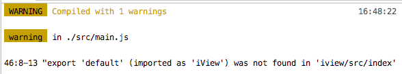

# [实用] 配置 iview 调试环境

> 项目选用 iview 做 UI 组件库，前前后后用了也差不多一年了，不得不说，质量还是不错的，遇到的问题并不多。
> 但偶尔遇到的时候，掌握熟练的调试技巧还是很有必要的，这里做个总结，没什么高深理论，单纯的经验总结。

## 1. 在开发环境中使用源码

通常，引入 iview 库的方式如下：

```javascript
// main.js
import Vue from "vue";
import iview from "iview";

Vue.use(iview);
```

从 [package.json](https://github.com/iview/iview/blob/2.0/package.json#L16) 文件来看，入口指向：`dist/iview.js`。
从该文件的内容，可以明显看出这是经过 webpack 编译的代码，代码行数达到 38384 行之多，随便抽取一个片段，是长这样的：

```javascript
var Component = Object(
  __WEBPACK_IMPORTED_MODULE_2__node_modules_vue_loader_lib_runtime_component_normalizer__[
    "a" /* default */
  ]
)(
  __WEBPACK_IMPORTED_MODULE_0__babel_loader_node_modules_vue_loader_lib_selector_type_script_index_0_tabs_vue___default.a,
  __WEBPACK_IMPORTED_MODULE_1__babel_loader_sourceMap_node_modules_vue_loader_lib_template_compiler_index_id_data_v_8d2761c6_hasScoped_false_optionsId_0_buble_transforms_node_modules_vue_loader_lib_selector_type_template_index_0_tabs_vue__[
    "render"
  ]
);
```

这是我们日常使用的 iview 代码，单纯从调用的角度来说，这完全没有问题，还省性能；但作为调试就稍显麻烦，想找个组件的源码都麻烦。
所以，这里做一个小改动，直接从 src 目录引入 iview：

```javascript
// main.js
import Vue from "vue";
import iview from "iview/src/index";

Vue.use(iview);
```

## 2. 使用 babel-loader 加载

引入源码后，webpack 编译**可能**会报错：


这是因为，通常情况下，为了提升 webpack 编译速度，我们都会尽可能避免编译第三方库，即通过配置 `babel-loader` ，刻意忽略 `node_modules` 路径，以 [vue-cli](https://github.com/vuejs/vue-cli/) 的 [webpack](https://github.com/vuejs-templates/webpack/blob/develop/template/build/webpack.base.conf.js#L56) 为例：

```javascript
{
  test: /\.js$/,
  loader: 'babel-loader',
  include: [resolve('src'), resolve('test'), resolve('node_modules/webpack-dev-server/client')]
}
```

此时 webpack 会使用其他 loader，比如 [script-loader](https://webpack.js.org/loaders/script-loader/) ，加载 `iview/src/index.js`文件，就有可能报错。
因此，如果遇到这个问题，修改 `babel-loader` 配置将 iview 包含进来即可，形如：

```javascript
{
  test: /\.js$/,
  loader: 'babel-loader',
  include: [resolve('src'), resolve('test'), resolve('node_modules/webpack-dev-server/client'), resolve('node_modules/iview/src')]
}
```

## 3. 修改 export 方式

修改配置后，重新运行 webpack，会报另一个错：



查看 `iview/src/index.js` 文件，发现导出语句是这样的：

```javascript
module.exports.default = module.exports = API; // eslint-disable-line no-undef
```

不知道是为了兼容旧版本，还是为了兼容其他环境，iview 在这里选择 `exports` 形式导出包内容，这里将代码改为：

```javascript
// module.exports.default = module.exports = API; // eslint-disable-line no-undef
export default API;
```

> 到这里，理论上 iview 的源码包已经导入，可以正常运行了，如果还有遇到其他问题，欢迎留言
> 欢迎关注我的 [github](https://github.com/VanMess/FE-knowledge/)，未来会写更多的经验总结
