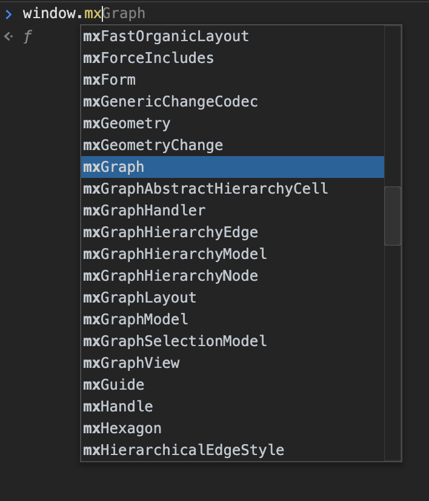
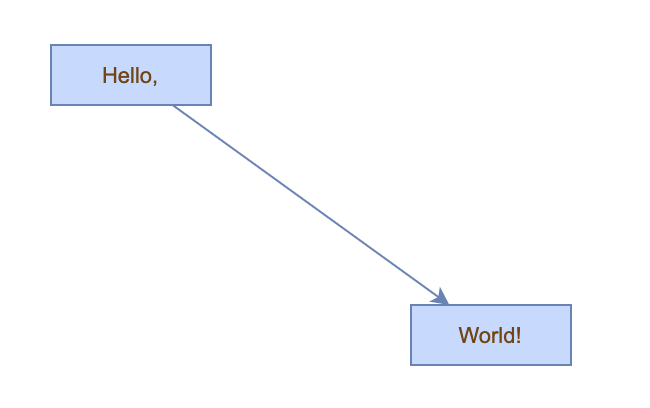

# 开始使用 mxGraph

> [mxGraph](https://github.com/jgraph/mxgraph) 是一个很优秀的 SVG 图形引擎、图形编辑器，但框架官方提供的文档太过偏向学术，实用价值低；社区对 mxGraph 的讨论也很少，导致框架入门成本极高。本人计划在未来一年内不定期推出 mxGraph 的使用教程，感兴趣的同学欢迎关注，共同学习，共同成长。

## 1. 简介

[mxGraph](https://github.com/jgraph/mxgraph) 第一个版本提交于 2012 年，当时前端工程化还在启蒙阶段，工具链严重缺失，用当下的眼光去看待 mxGraph 简直不堪入目。但是框架的架构设计的非常优雅，即使放在当前前端百家齐放的环境下依然足够优秀，作为一个范本，研究 mxGraph 源码可以学习到：

1. 编辑器开发以及编辑器实现中的常见设计模式
2. 图形布局算法
3. 图形引擎如何管理大量图形元素
4. 如何抽象表达图形，以支持自定义扩展
5. 等等

本文将作为系列教程的起点，介绍如何开始使用 mxGraph。

## 2. 使用本地文件

最简单的，可通过 `git clone git@github.com:jgraph/mxgraph.git` 将库文件下载到本地后，在页面中使用 `script` 标签引入例如：

```html
<!-- 使用本地文件 -->
<script src="./libs/mxGraph/mxClient.min.js"></script>
```

clone 命令会将仓库所有克隆下来，其中只有 [`mxgraph/javascript/src/mxClient.min.js`](https://github.com/jgraph/mxgraph/blob/master/javascript/mxClient.min.js) 或 [`mxgraph/javascript/src/mxClient.js`](https://github.com/jgraph/mxgraph/blob/master/javascript/mxClient.js) 能够满足应用需求，其他文件忽略即可。

引入 `mxClient.min.js` 后，全局对象 window 下会增加许多 `mx` 前缀的属性：



后续可使用这些全局变量构建应用，例如：

```html
<!DOCTYPE html>
<html lang="en">
	<head>
		<meta charset="utf-8" />
		<meta name="viewport" content="width=device-width, initial-scale=1" />
		<title>mxGraph Demo</title>
	</head>
	<body>
		<div id="root"></div>

		<script type="text/javascript" src="../mxClient.min.js"></script>
		<script type="text/javascript">
			// mxGraph 被暴露在window下，所以可以直接调用
			const graph = new mxGraph(document.getElementById('root'));
			const parent = graph.getDefaultParent();

			// 启动一次更新会话
			graph.getModel().beginUpdate();
			try {
				// 插入一个矩形
				const v1 = graph.insertVertex(parent, null, 'Hello,', 20, 20, 80, 30);
				// 插入第二个矩形
				const v2 = graph.insertVertex(parent, null, 'World!', 200, 150, 80, 30);
				// 连接两个矩形
				graph.insertEdge(parent, null, '', v1, v2);
			} finally {
				// 结束更新会话
				graph.getModel().endUpdate();
			}
		</script>
	</body>
</html>
```

示例效果：



## 3. 使用 CDN

直接使用 `mxClient.min.js` 文件有两个主要缺点，一是需要将库文件下载后放入项目中，对后续的版本管理并不友好；二是落后的构建方式导致 `mxClient.min.js` 会暴露很多变量到全局空间造成污染。在这种情况下，如果还是希望能用 `<script>` 方式引入，可以考虑使用 CDN 服务：

```html
<script src="//cdn.jsdelivr.net/npm/mxgraph@4.1.1/javascript/dist/build.min.js"></script>
```

注意这里使用的是 `build.min.js` 文件，与 `mxClient.min.js` 不同，该文件将 mxGraph 代码包裹进工厂函数中，以解决全局空间污染的问题：

```javascript
(function (root, factory) {
	if (typeof define === 'function' && define.amd) {
		define([], factory);
	} else if (typeof module === 'object' && module.exports) {
		module.exports = factory();
	} else {
		root.mxgraph = factory();
	}
})(this, function () {
	return function (opts) {
		for (var name in opts) {
			this[name] = opts[name];
		}
		var __mxOutput = {};
		/* 此处插入 mxGraph 代码 */
		return __mxOutput;
	};
});
```

`build.min.js` 对外暴露了一个工厂函数，用法与上面示例略有不同，需要先执行工厂函数初始化 `mxGraph` 命名空间，示例：

```html
4
<!DOCTYPE html>
<html lang="en">
	<head>
		<meta charset="utf-8" />
		<meta name="viewport" content="width=device-width, initial-scale=1" />
		<title>mxGraph Demo</title>
	</head>
	<body>
		<div id="root"></div>
		<script src="//cdn.jsdelivr.net/npm/mxgraph@4.1.0/javascript/dist/build.js"></script>
		<script>
			// 初始化命名空间
			// 这里的 mxgraph 是 `build.min.js` 暴露出的工厂函数
			const ns = mxgraph({
				mxBasePath: '//cdn.jsdelivr.net/npm/mxgraph@4.1.0/javascript/src',
			});

			const graph = new ns.mxGraph(document.getElementById('root'));
			const parent = graph.getDefaultParent();

			// 启动一次更新会话
			graph.getModel().beginUpdate();
			try {
				const v1 = graph.insertVertex(parent, null, 'Hello,', 20, 20, 80, 30);
				const v2 = graph.insertVertex(parent, null, 'World!', 200, 150, 80, 30);
				graph.insertEdge(parent, null, '', v1, v2);
			} finally {
				// 结束更新会话
				graph.getModel().endUpdate();
			}
		</script>
	</body>
</html>
```

> 提示：
>
> 上述代码虽然能正常渲染出 `hello world!` 字样，但控制台上会报很多错误，同样是因为构建方式导致的 bug，在本示例中请直接忽略。

## 3. 使用 webpack 等模块化方案引入

自 3.7.2 版本起，mxGraph 开始将库打包发布到 npm，开发者可以使用 `yarn add mxgraph` 进行安装。 `mxgraph` 包的主入口文件是 `build.min.js`，默认导入的是如前面例子所说的工厂函数，示例：

```javascript
const ns = require('mxgraph'))({});
// 或者 import 语法
// import mxGraphFactory from 'mxgraph';
// const ns = mxGraphFactory({});
const graph = new ns.mxGraph(this.$refs.main);

const parent = graph.getDefaultParent();

graph.getModel().beginUpdate();
try {
	const v1 = graph.insertVertex(parent, null, 'Hello,', 20, 20, 80, 30);
	const v2 = graph.insertVertex(parent, null, 'World!', 200, 150, 80, 30);
	const e1 = graph.insertEdge(parent, null, '', v1, v2);
} finally {
	graph.getModel().endUpdate();
}
```

> 提示：
>
> 既然可以通过 npm 安装，前面为什么还要花大量篇幅介绍 `script` 引入呢？主要是因为 mxGraph 文档极度不完善，其中最有参考价值的是 [`官方 examples`](https://github.com/jgraph/mxgraph/blob/master/javascript/examples)，而这些示例代码全都使用 `<script>` 引入本地库文件，因此理解不同引入模式能够帮助更好地理解示例。
>
> 另外，目前社区尚未有 mxGraph 比较好的 typescript 类型定义库，所以还无法在 ts 环境下畅快地使用。

## 下节预告

[mxGraph](https://github.com/jgraph/mxgraph) 工程方案非常凌乱，仓库包含了许多无关代码以及难以理解的 trick，下一节将简要讨论 mxGraph 仓库中各个重要文件的作用，为后续理解源码做好铺垫。
