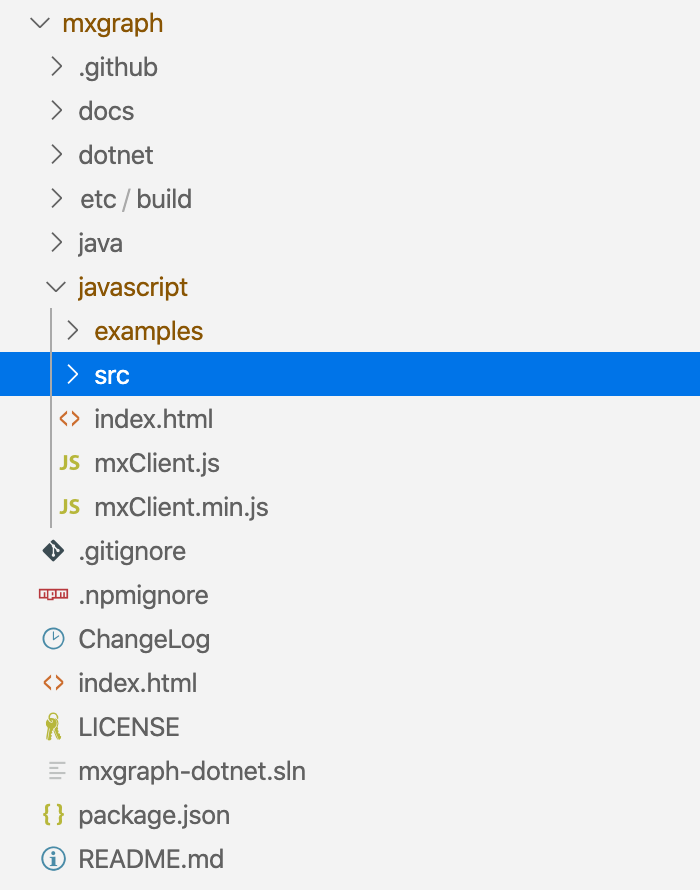

# mxgraph 项目结构说明

## 1. 目录说明

[mxgraph](https://github.com/jgraph/mxgraph) 目录结构如下：



-   [docs](https://github.com/jgraph/mxgraph/tree/master/docs): mxgraph 说明文档
-   [dotnet](https://github.com/jgraph/mxgraph/tree/master/dotnet): 基于 .net 的编辑器后端实现，暂时无需关注
-   [etc/build](https://github.com/jgraph/mxgraph/tree/master/etc/build): 这个目录下只有一份 `Gruntfile.js` 文件，用于构建生成环境版本
-   [java](https://github.com/jgraph/mxgraph/tree/master/java): 基于 java 的编辑器后端实现，暂时无需关注
-   [javascript](https://github.com/jgraph/mxgraph/tree/master/javascript): mxgraph 核心代码文件夹，其中 `javascript/src` 为框架源码；`javascript/examples` 为示例代码。

mxgraph 仓库主要包含几类类型的资源，最核心的是 `javascript/src` 目录下的图形引擎源码；其次是 `javascript/src/editor` 目录中基于图形引擎实现的图形编辑器；之外还有基于 .net、java 的后端示例；以及作为学习资源的 `docs` 目录下的文档，和 `javascript/examples` 目录下的示例代码，下面逐一解释。

## 2. 官方文档

学习 mxgraph，可以先从官方提供的文档出发。mxgraph 仓库中存在以下几类文档，对入门有比较大的帮助：

1. [tutorial](https://github.com/jgraph/mxgraph/blob/master/docs/tutorial.html): 项目概览文档，概要说明 mxgraph 的作用、组件结构，并提供了一个简单的入门示例，首次接触项目时有较高的指导作用。
2. [manual](https://github.com/jgraph/mxgraph/blob/master/docs/manual.html): 用户手册文档，详细说明了 mxgraph 的设计思路、开发动机、使用方法，以及 mxgraph 如何管理图像的数据模型。前期建议略读，写几个示例对框架有了基本的感性认知后可以再回过头来细读。
3. [examples](https://github.com/jgraph/mxgraph/blob/master/javascript/index.html): 项目示例索引文档，详细介绍了每一个示例的用途，可用作参考学习。
4. [api](https://github.com/jgraph/mxgraph/blob/master/docs/js-api/index.html): API 手册，提供了 mxgraph 下所有类、类方法、类属性的使用说明，可以在需要用到某些类时查询。

建议的阅读顺序是，一细读 tutorial，能够帮助建立对 mxgraph 的感性认知；二略读 manual，了解 mxgraph 数据模型的管理方法；三细读各个示例代码，从示例中学习、领悟各类接口的用法；必要时可以结合 api 文档查阅各个接口的详细信息。

以上各类文档均可双击对应的 html 文件，在浏览器打开查阅。

> 提示：
>
> mxgraph 官方文档质量写的简直惜字如金，很多概念一笔带过，没有详尽说明，加上社区对 mxgraph 的讨论热度很低，导致对于使用者而言，框架学习成本很高。这种状况下，笔者认为最有效的学习方法只能是结合示例、API 文档、源码，三个维度互相对照学习。

## 3. 核心目录结构

mxgraph 框架代码存放于 [javascript/src](https://github.com/jgraph/mxgraph/tree/master/javascript/src) 目录下，主要文件有：

```
mxgraph
└─── javascript
│   └─── src
│       └─── css
│       └─── images
│       └─── js
│            └─── editor
│            └─── handler
│            └─── io
│            └─── layout
│            └─── model
│            └─── shape
│            └─── util
│            └─── view
│            |    index.txt
│       └─── resources
│       │   index.html
│       │   mxClient.js
│       │   mxClient.min.js
```

-   `javascript/src/js`: mxgraph 的 JS 代码，基本上所有功能都是在这里实现。
-   `javascript/src/css`: mxgraph 组件的样式实现，可暂时忽略。
-   `javascript/src/images`: 图表编辑器中需要用到的图像资源，可忽略。
-   `javascript/src/resource`: 图形编辑器的多语言定义文件，可忽略。

mxgraph 的核心功能都定义在 `javascript/src/js` 目录下，所以后续的学习主要都是集中在这部分代码中。几个子目录的主要作用分别为：

-   `model` 子目录是数据管理模型的实现，数据模型记录着 mxgraph 实例的图形结构及节点的详细信息，并对外暴露一系列更新、删除、插入接口，我们使用 mxgraph 时会跟这部分接口经常打交道。关于数据模型的更多探索，将在后续补充。
-   `shape` 定义了几种主要的图元类型，包括线、标签、箭头、多边形、四边形、泳道等。
-   `view` 是框架对外交互的主要接口层，包含了图形交互接口 mxGraph 类、样式管理接口 mxStylesheet、图元编辑器 mxCellEditor 等。
-   `handler` 定义了框架中图元的几种常见的交互行为逻辑，比如处理快捷键逻辑的 mxKeyHandler；处理连接线分片的 mxEdgeSegmentHandler；处理图元高亮效果的 mxCellHighlight 等。
-   `layout` 定义 mxgraph 所使用的布局逻辑，包括堆叠布局 mxStackLayout；泳道布局 mxSwimlaneLayout；圆形布局 mxCircleLayout。
-   `util` 包含各种工具函数。
-   `io` 定义了几种应对不同时态的编解码器，可用以实现 mxgraph 实例状态的持久化。
-   `editor` 短小精悍的编辑器实现，内置快捷键、弹出菜单、工具栏等功能支持。

此外， `javascript/src/mxClient.js` 是框架的入口文件，它一方面定义了一系列环境变量；一方面声明框架的基础依赖文件列表。 `javascript/src/mxClient.min.js` 是经过 `etc/build/Gruntfile.js` 执行连接、合并、压缩操作后的版本，可用作生产环境库文件。

> 提示：
>
> mxgraph 仓库包含两类功能代码，一是作为底层的图形引擎；二是作为上层应用的图形编辑器。源码中 `javascript/src/js/editor` 是编辑器的实现代码， `javascript/src/css`、`javascript/src/images`、`javascript/src/resource` 都是图形编辑器的资源依赖，建议读者暂时忽略这部分代码，先集中精力学习图形引擎的使用方法。

## 4. 示例代码

mxgraph 官方提供的示例都在 [`javascript/examples`](https://github.com/jgraph/mxgraph/tree/master/javascript/examples) 目录下，合计有 88 个，可以双击 `javascript/index.html` 打开示例索引文档。虽然有如此多的示例代码，但每一个示例都没有足够的细节说明；官方也没有提供一个由浅入深的学习流程，为此我简单总结了一份阅读顺序：

1. helloworld.html，虽然是很基础的入门示例，但完整演示了 mxgraph 框架的使用流程。
2. 通过 shape.html 学习如何自定义图元；通过 stencils.html 学习如何以 xml 格式定义图元样式。
3. 通过 events.html 学习如何监听 mxgraph 实例对象的事件，完整的事件列表可参考 `javascript/docs/jsapi/index.html` 文档。
4. 通过 layers.html 学习图形分层的概念，分层功能有助于管理图形元素，大多数图形引擎都会有类似的功能设计。
5. 通过 groups.html 学习图形元素的分组合并，分组功能能将复数的图形在逻辑上合并为 **一个** 元素，是另一种维度的管理方法。
6. 通过 stylesheet.html 学习如何定义图形样式。
7. 通过 images.html 学习如何在 mxgraph 中嵌入自定义图案。
8. 通过 markers.html 学习如何修改连接线的样式。
9. 通过 labels.html、secondlabel.html 学习如何为图形添加说明文字；通过 indicators.html 学习如何为父级图元增加指示器；通过 htmllabel.html 学习如果以 label 形式嵌入 html 内容。
10. 通过 anchors.html、control.html 学习如何为图形组件添加交互功能。
11. 通过 graphlayout.html、autolayout.html、boundary.html 学习 mxgraph 的布局功能；之后还可通过 hierarchicallayout.html、swimlanes.html 学习更复杂的布局逻辑。
12. 通过 codec.html、jsondata.html 学习如何执行数据模型的编解码功能，以及 fileio.html 学习如何实现图形内容的持久化与还原。
13. 通过 dragsource.html、drop.html 学习如何实现图形拖拽操作，以及 handles.html 学习更复杂的交互功能。

精度以上事例，结合 `javascript/docs/jsapi/index.html` 文档相信读者会对 mxgraph 有一个更高维度的认知。
