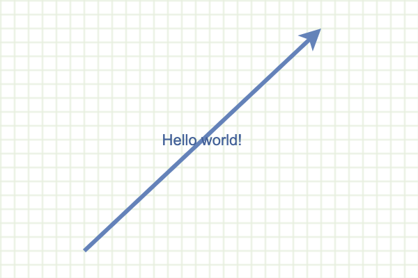

# mxgraph 系列【3】： 底层状态树 mxCell

## 1. 简介

[mxgraph](https://github.com/jgraph/mxgraph) 内部使用一种树形数据结构记录图形文档的内容，在内容树上，每一个节点代表一个图形元素，元素信息会被存储在节点对象上；节点的父子关系表示父节点图形包含子节点图形，可以用于实现图形的分层、分组功能。例如，对于下面的图形：

内容树是图形文档的底层数据模型，有点像 vdom 之于 react；vnode 之于 vue。mxgraph 的许多功能都是围绕内容树展开的，例如渲染器 [mxCellRenderer](https://github.com/jgraph/mxgraph/blob/master/javascript/src/js/view/mxCellRenderer.js) 根据内容树渲染出图形文档；编解码器 [mxCellCodec](https://github.com/jgraph/mxgraph/blob/master/javascript/src/js/io/mxCellCodec.js) 实现了外部存储格式与内容树之间的互相转换；各种 [布局算法](https://github.com/jgraph/mxgraph/blob/master/javascript/src/js/layout/mxGraphLayout.js) 的基本操作单位也都是内容树节点。因此，深入理解内容树模型能够为后面的源码学习过程打下扎实基础！

内容树模型由以下几个类实现：

1. [mxGraphModel](https://github.com/jgraph/mxgraph/blob/master/javascript/src/js/model/mxGraphModel.js): 内容树模型，主要实现一系列树结构操作方法。
2. [mxCell](https://github.com/jgraph/mxgraph/blob/master/javascript/src/js/model/mxCell.js): 内容树节点，用于存储图形、连接线、分层等图元的状态信息。
3. [mxGeometry](https://github.com/jgraph/mxgraph/blob/master/javascript/src/js/model/mxGeometry.js): 树节点的几何信息，记录了图形元素的宽高、坐标位置；连线的开始节点、结束节点等几何特性。

上面是哪个类的关系如下：

本文主要关注内容树节点 [mxCell](https://github.com/jgraph/mxgraph/blob/master/javascript/src/js/model/mxCell.js) 的用法，关于 mxGraphModel、mxGeometry 的内容后续会用专门章节作介绍。

## 2. 初识 mxCell

[mxCell](https://github.com/jgraph/mxgraph/blob/master/javascript/src/js/model/mxCell.js) 类定义在 `javascript/src/js/model/mxCell.js` 文件中，构造函数签名： `function mxCell(value, geometry, style)`，参数解释：

-   `value`: 用于定义图元的内容，支持传入 dom 对象、字符串。
-   `geometry`: 图形的几何数值，对于 vertex 类型记录了图形的 x、y、width、height 属性；edge 类型还会记录线段两端连接的点。
-   `style`: 图形样式

如下示例展示了如何构造 mxCell 对象：

```javascript
// 构造mxCell实例
const cell = new mxCell('Hello world!', new mxGeometry(60, 80, 100, 100), 'fillColor=#ddd');
// 将cell设定为几何图案类型
cell.vertex = true;

// 使用 cell 对象构造模型
const model = new mxGraphModel(cell);
// 渲染模型
new mxGraph(document.getElementById('container'), model);
```

渲染结果：


> 提示：
>
> mxgraph 的样式功能是在 CSS 样式体系基础上扩展而成，除标准的样式属性外还定义了很多自有的样式属性，后续会另开章节做介绍。

## 3. 使用 mxCell 画图

### 3.1 矩形

当 `vertex=true` 时，mxCell 默认图形样式就是矩形，所以渲染矩形时只要指定起始坐标、宽高属性即可，例如：

```javascript
// 构造mxCell实例
const cell = new mxCell(
	null,
	// 通过 mxGeometry 指定矩形的宽高、起始坐标
	new mxGeometry(60, 80, 100, 100)
);
// 将cell设定为几何图案类型
cell.vertex = true;
```

渲染效果：


### 3.2 线段

使用 mxCell 画线段的逻辑会稍微复杂一些，代码片段：

```javascript
const cell = new mxCell('Hello world!', new mxGeometry(), 'strokeWidth=3;');
// 将cell设定为线段
cell.edge = true;
// 设置起始点
cell.geometry.setTerminalPoint(new mxPoint(60, 180), true);
// 设置终结点
cell.geometry.setTerminalPoint(new mxPoint(230, 20), false);
```

线段的位置是由线段两端端点位置确定，例如上例初始化 mxCell 后，还需要调用 `setTerminalPoint` 设定线段的起始结束位置才能正常渲染。上例渲染结果：



更进一步的，在一条线段内还可以使用 `points` 属性拆分出多个片段，例如：

```javascript
const cell = new mxCell('Hello world!', new mxGeometry(), 'strokeWidth=3;');
// 将cell设定为线段
cell.edge = true;
// 设置起始点
cell.geometry.setTerminalPoint(new mxPoint(60, 180), true);
// 设置终结点
cell.geometry.setTerminalPoint(new mxPoint(230, 20), false);
// 使用 points 定义多个中间节点
cell.geometry.points = [new mxPoint(70, 50), new mxPoint(120, 80)];
```

渲染效果：


### 3.3 更多内置图形

除了矩形和线段外，mxGraph 还内置支持其它图形，先来看一个示例：

```html
<!DOCTYPE html>
<html lang="zh-CN">
	<head>
		<meta charset="utf-8" />
		<meta http-equiv="X-UA-Compatible" content="IE=edge" />
		<meta name="viewport" content="width=device-width,initial-scale=1.0" />
		<title>mxgraph Example</title>
		<style>
			#container {
				background: url('../../assets/grid.gif');
			}
		</style>
		<script type="text/javascript">
			mxBasePath = '//cdn.jsdelivr.net/npm/mxgraph@4.1.1/javascript/src';
		</script>
	</head>
	<body>
		<div id="container" style="width: 400px; height: 400px;"></div>

		<script src="//cdn.jsdelivr.net/npm/mxgraph@4.1.1/javascript/mxClient.min.js"></script>
		<script type="text/javascript">
			function run(container) {
				const shapes = [
					// mxGraph 内置支持如下图形：
					'actor',
					'cloud',
					'cylinder',
					'doubleEllipse',
					'ellipse',
					'hexagon',
					'image;image=https://jgraph.github.io/mxgraph/docs/images/mxgraph_logo.gif',
					'rectangle',
					'rhombus',
					'swimlane',
					'triangle',
				];
				const root = new mxCell(null, new mxGeometry(), null);
				for (let i = 0; i < shapes.length; i++) {
					const shape = shapes[i];
					const xOffset = i % 4,
						yOffset = Math.floor(i / 4),
						x = xOffset * 100 + 20,
						y = yOffset * 100 + 20;
					const geometry = new mxGeometry(x, y, 60, 60);
					const cell = new mxCell(
						shape.split(';')[0],
						geometry,
						// 通过shape指定cell的图形类别
						`shape=${shape};verticalLabelPosition=bottom;spacingBottom=40`
					);
					cell.vertex = true;
					root.insert(cell);
				}
				const model = new mxGraphModel(root);
				new mxGraph(container, model);
			}

			window.addEventListener('load', () => {
				run(document.getElementById('container'));
			});
		</script>
	</body>
</html>
```

示例效果：

;

示例中，需要在构造 mxCell 实例时，通过 style 参数设定 cell 的图形类别，核心代码：

```javascript
const cell = new mxCell(
	null,
	new mxGeometry(0, 0, 100, 100),
	//  通过shape属性修改图形类别
	`shape=triangle`
);
```

如果是图像类型，还需要通过 `image` 传入图片地址：

```javascript
const cell = new mxCell(
	null,
	new mxGeometry(0, 0, 100, 100),
	// shape 属性指定位image
	// image 属性设定图片地址
	`shape=image;image=https://jgraph.github.io/mxgraph/docs/images/mxgraph_logo.gif`
);
```

### 3.4 自定义图形类

在 mxGraph 中，所有图形的基类都是 [mxShape](https://github.com/jgraph/mxgraph/blob/master/javascript/src/js/shape/mxShape.js) 类，用户只需要继承该类即可定义出新的图形类别，核心步骤：

```javascript
// 1. 继承 mxShape 类
class CustomShape extends mxShape {
	constructor() {
		super();
	}

	// 图形的渲染方法
	paintBackground(c, x, y, w, h) {}
}

// 2. 在渲染器 mxCellRenderer 中注册图形类
mxCellRenderer.registerShape('customShape', CustomShape);

const cell = new mxCell(
	null,
	new mxGeometry(100, 50, 50, 100),
	// 3. 创建 mxCell时，依然通过 style 参数的shape属性定义图形类别
	'shape=customShape'
);
```

完整示例：

```html
<!DOCTYPE html>
<html lang="zh-CN">
	<head>
		<meta charset="utf-8" />
		<meta http-equiv="X-UA-Compatible" content="IE=edge" />
		<meta name="viewport" content="width=device-width,initial-scale=1.0" />
		<title>mxgraph Example</title>
		<style>
			#container {
				background: url('../../assets/grid.gif');
			}
		</style>
		<!-- Sets the basepath for the library if not in same directory -->
		<script type="text/javascript">
			mxBasePath = '//cdn.jsdelivr.net/npm/mxgraph@4.1.1/javascript/src';
		</script>
	</head>
	<body>
		<div id="container" style="width: 300px; height: 200px;"></div>

		<script src="//cdn.jsdelivr.net/npm/mxgraph@4.1.1/javascript/mxClient.min.js"></script>
		<script type="text/javascript">
			// 继承 mxShape 基类，扩展自定义图形类
			class CustomShape extends mxShape {
				constructor() {
					super();
				}

				paintBackground(c, x, y, w, h) {
					c.translate(x, y);

					// Head
					c.ellipse(w / 4, 0, w / 2, h / 4);
					c.fillAndStroke();

					c.begin();
					c.moveTo(w / 2, h / 4);
					c.lineTo(w / 2, (2 * h) / 3);

					// Arms
					c.moveTo(w / 2, h / 3);
					c.lineTo(0, h / 3);
					c.moveTo(w / 2, h / 3);
					c.lineTo(w, h / 3);

					// Legs
					c.moveTo(w / 2, (2 * h) / 3);
					c.lineTo(0, h);
					c.moveTo(w / 2, (2 * h) / 3);
					c.lineTo(w, h);
					c.end();

					c.stroke();
				}
			}

			// 需要在渲染器 mxCellRenderer 中注册图形
			mxCellRenderer.registerShape('customShape', CustomShape);

			function run(container) {
				const cell = new mxCell(
					'Hello world!',
					new mxGeometry(100, 50, 50, 100),
					// 依然通过style参数的 shape 属性指定图形类别
					'shape=customShape'
				);
				cell.vertex = true;

				const model = new mxGraphModel(cell);
				new mxGraph(container, model);
			}

			window.addEventListener('load', () => {
				run(document.getElementById('container'));
			});
		</script>
	</body>
</html>
```

示例效果：


### 3.5 使用 stencils 画图

除了通过扩展 `mxShape` 实现自定义图形类之外，还可以使用 stencils 接口定义新的图形类别，主要步骤有：

```javascript
// 1. xml 格式定义图形内容
const shapes = `<shapes>...</shapes>`;
// 2. 将字符串转化为 DOM 对象
const node = new DOMParser().parseFromString(shapes, 'text/xml');
// 3. 注册 stencils 对象
mxStencilRegistry.addStencil('or', new mxStencil(node.firstChild));

const cell = new mxCell(
	null,
	new mxGeometry(100, 50, 50, 100),
	// 4. 创建 mxCell时，依然通过 style 参数的shape属性定义图形类别
	'shape=or'
);
```

完整示例：

```html
<!DOCTYPE html>
<html lang="zh-CN">
	<head>
		<meta charset="utf-8" />
		<meta http-equiv="X-UA-Compatible" content="IE=edge" />
		<meta name="viewport" content="width=device-width,initial-scale=1.0" />
		<title>mxgraph Example</title>
		<style>
			#container {
				background: url('../../assets/grid.gif');
			}
		</style>
		<!-- Sets the basepath for the library if not in same directory -->
		<script type="text/javascript">
			mxBasePath = '//cdn.jsdelivr.net/npm/mxgraph@4.1.1/javascript/src';
		</script>
	</head>
	<body>
		<div id="container" style="width: 300px; height: 200px;"></div>

		<script src="//cdn.jsdelivr.net/npm/mxgraph@4.1.1/javascript/mxClient.min.js"></script>
		<script type="text/javascript">
			// xml 形式定义图形内容
			const shapes = `<shapes>
          <shape name="or" aspect="variable">
              <background>
                  <path>
                      <move x="0" y="0" />
                      <quad x1="100" y1="0" x2="100" y2="50" />
                      <quad x1="100" y1="100" x2="0" y2="100" />
                      <close/>
                  </path>
              </background>
              <foreground>
                  <fillstroke/>
              </foreground>
          </shape>
      </shapes>`;
			// 将字符串的xml值解析为dom对象
			const parser = new DOMParser();
			const node = parser.parseFromString(shapes, 'text/xml');
			// 注册画笔
			mxStencilRegistry.addStencil('or', new mxStencil(node.firstChild));

			function run(container) {
				const cell = new mxCell(null, new mxGeometry(100, 50, 50, 100), 'shape=or');
				cell.vertex = true;

				const model = new mxGraphModel(cell);
				new mxGraph(container, model);
			}

			window.addEventListener('load', () => {
				run(document.getElementById('container'));
			});
		</script>
	</body>
</html>
```

示例效果：


> 提示：
>
> 自定义 mxShape 与 stencils 接口都能扩展出新的图形类别，mxShape 通过类形式定义，会有一定的开发成本，但是能够定制更多图形逻辑；而 stencils 可以通过外部的 xml 文件定义，开发与管理上会更方便一些。具体使用何种方式，可根据实际需求选择。
>
> 两套方法论都比较复杂，不是一个小片段就能说清楚的作者后续会另开专题，做详细介绍。

<!-- TODO -->
<!-- 违反了单一原则 -->

<!-- TODO -->
<!-- 第四节 -->
<!-- 如何执行变换，例如：translate、rotate等 -->

## 4. 总结

至此为止，本节内容就差不多结束了。文章主要介绍了底层数据结构 mxCell 以及如何使用 mxCell 画出各种不同图形。随着学习的深入，我们发现有更多可以挖掘的点，包括：

1. mxGraphModel 的使用方法
2. mxGraph 中的 style 体系是如何使用、运作的
3. 如何执行图形的几何变换
4. 自定义图形类、自定义 stencils 的使用方法
5. ...

未来会逐步补充系列文章，力求能够帮助有需要的人深入理解 mxGraph 的用法和原理，感兴趣的同学欢迎关注。
